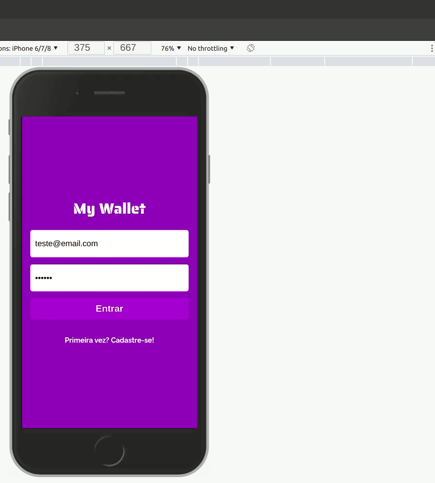

<h1 align="center">
     💸 <a href="#" alt="site do ecoleta"> myWallet</a>
</h1>

<h3 align="center">
    🤑 Seu app preferido de controle das suas finanças! 
</h3>

---

<h4 align="center">
	🚧   Concluído 🚀 🚧
</h4>

---
<br><br>
Tabela de conteúdos
=================
<!--ts-->
   * [Sobre o projeto](#-sobre-o-projeto)
   * [Funcionalidades](#-funcionalidades)
   * [Layout](#-layout)
   * [Como executar o projeto](#-como-executar-o-projeto)
     * [Pré-requisitos](#pré-requisitos)
   * [Tecnologias](#-tecnologias)
   * [Autor](#-autor)
<!--te-->




## 💻 Sobre o projeto
<br>

💸 myWallet - é um web app de controle financeiro pessoal, nele o usuário pode controlar todas as receitas e despesas do mês.


Projeto desenvolvido durante a **Formação Driven** oferecida pela [Driven Education](https://www.driven.com.br/?utm_source=search&utm_medium=google-ads&utm_campaign=branding&gclid=Cj0KCQiA7oyNBhDiARIsADtGRZa8cqYastMgHzxSP4gfGdixu6ib79VG7zi6xrecJNkRGD1D2Ap7k20aAuxIEALw_wcB).
Durante as semanas de projeto na formação Driven, os instrutores passam os requisitos que o projeto deve atingir, porém todo o código da aplicação é desenvolvido pelo autor [Paulo Piotto](https://github.com/Paulo-Piotto)

---

## ⚙️ Funcionalidades

- [x] Ná página inicial o usuário pode fazer login na sua conta ou optar por criar uma conta com:
  - [x] Nome
  - [x] Email
  - [x] Senha
- [x] Uma vez logado o usuário pode verificar suas últimas movimentações financeiras ordenadas por data
- [x] Clicando em nova entrada, o usuário pode inserir uma nova quantia nas suas transações e uma descrição
- [x] Clicando em nova saída, o usuário pode remover uma nova quantia nas suas transações e inserir uma descrição
- [x] O usuário também pode fazer logout a qualquer momento clicando no ícone no canto superior direito   

---

## 🎨 Layout

O layout da aplicação está disponível no Figma:

<a href="https://www.figma.com/file/p37uJdpZWRLED7YEwDFfUd/MyWallet?node-id=0%3A1">
  
</a>

---

## 🚀 Como executar o projeto

Este projeto consiste em duas partes:
- Frontend(Website)
- Backend(Servidor)

💡O Frontend precisa que o Backend esteja sendo executado para funcionar.

### Pré-requisitos

Antes de começar, você vai precisar ter instalado em sua máquina as seguintes ferramentas:
[Git](https://git-scm.com).
Um banco de dados [PostgreSQL](https://www.postgresql.org/).
O [Node.js] instalado no seu computador.
Além disto é bom ter um editor para trabalhar com o código como [VSCode](https://code.visualstudio.com/)

#### 🎲 Rodando o Backend (servidor)

```bash
#acesse o usuario postgres
$ sudo su postgres
# entre no terminal postgres
$ psql
#Crie um banco de dados postgres
$ CREATE DATABASE mywallet
#Conecte no banco
$ \c mywallet
#Conectado ao banco execute todos os comandos do arquivo dump.sql
#Saia do terminal postgres
$ ctrl + d
#Saia do usuário postgres
$ ctrl + d
# Clone este repositório
$ git clone https://github.com/Paulo-Piotto/Projeto_14_myWallet_backend
# Acesse a pasta do projeto no terminal/cmd
$ cd Projeto_14_myWallet_backend
# Vá para a pasta server
$ npm install
# Execute a aplicação em modo de desenvolvimento
$ npm run start
# O servidor inciará na porta:4000 
```

#### 🧭 Rodando a aplicação web (Frontend)

```bash
# Clone este repositório
$ git clone https://github.com/Paulo-Piotto/Projeto_14_myWallet_front.git
# Acesse a pasta do projeto no seu terminal/cmd
$ cd projeto_14_myWallet_front
# Instale as dependências
$ npm install
# Execute a aplicação em modo de desenvolvimento
$ npm run start
# A aplicação será aberta na porta:3000 - acesse http://localhost:3000
```

---

## 🛠 Tecnologias

As seguintes ferramentas foram usadas na construção do projeto:

#### **Website**  ([React](https://reactjs.org/))

-   **[React Router Dom](https://github.com/ReactTraining/react-router/tree/master/packages/react-router-dom)**
-   **[Axios](https://github.com/axios/axios)**
-   **[Styled Components](https://styled-components.com/)**
-   **[React Icons](https://react-icons.github.io/react-icons/)**
-   **[Day.js](https://day.js.org/)**

> Veja o arquivo  [package.json](https://github.com/Paulo-Piotto/Projeto_14_myWallet_front/blob/main/package.json)

#### **Server**  ([Node](https://nodejs.org/en/))

-   **[Bcrypt](https://www.npmjs.com/package/bcrypt)**
-   **[CORS](https://www.npmjs.com/package/cors)**
-   **[Day.js](https://day.js.org/)**
-   **[joi](https://joi.dev/)**
-   **[node-postgres](https://node-postgres.com/)**
-   **[uuId](https://www.npmjs.com/package/uuid)**
-   **[Jest](https://jestjs.io/pt-BR/)**
-   **[supertest](https://www.npmjs.com/package/supertest)**

> Veja o arquivo  [package.json](https://github.com/Paulo-Piotto/Projeto_14_myWallet_backend/blob/main/package.json)
---

## 🦸 Autor

<a href="https://www.linkedin.com/in/paulo-henrique-amancio-piotto-b745a1167/">
 
 <br />
 <sub><b>Paulo Piotto</b></sub></a> <a href="https://www.linkedin.com/in/paulo-henrique-amancio-piotto-b745a1167/">🚀</a>
 <br />

---

Feito com ❤️ por Paulo Piotto 👋🏽 [Entre em contato!](https://www.linkedin.com/in/paulo-henrique-amancio-piotto-b745a1167/)

---